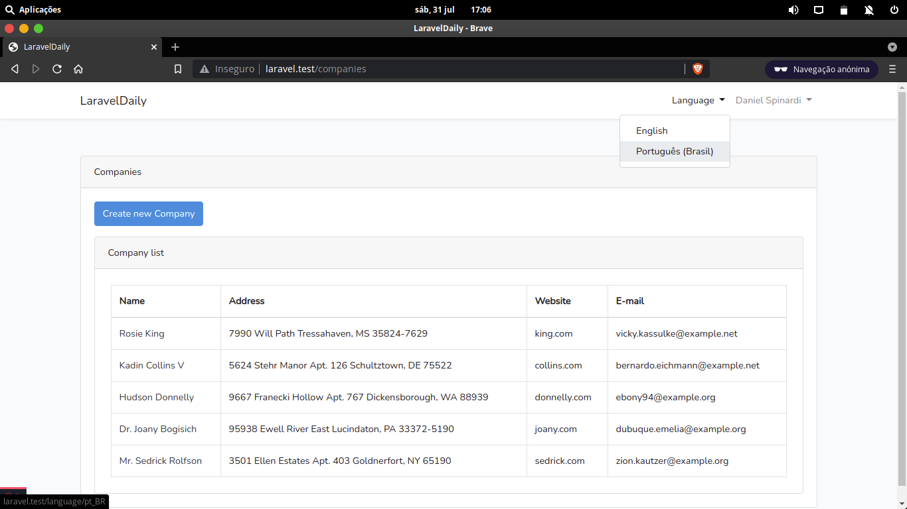
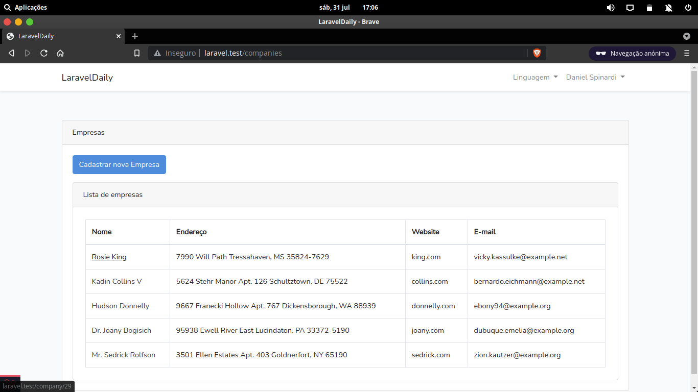
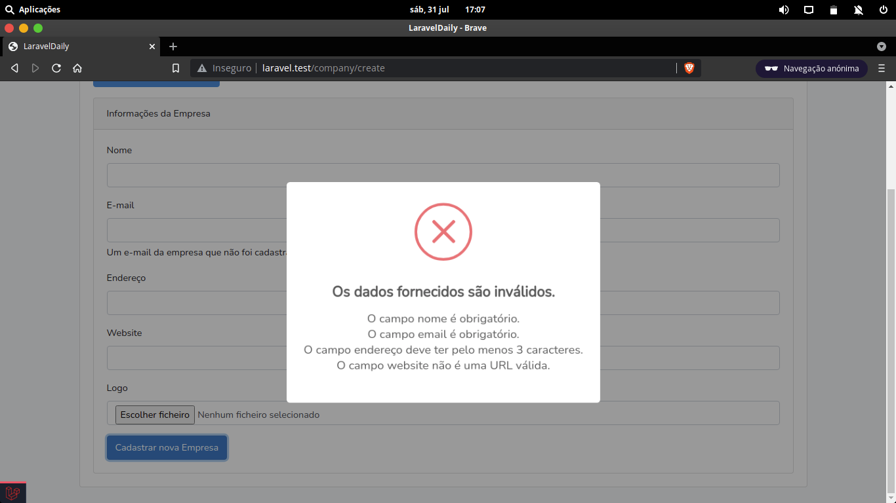
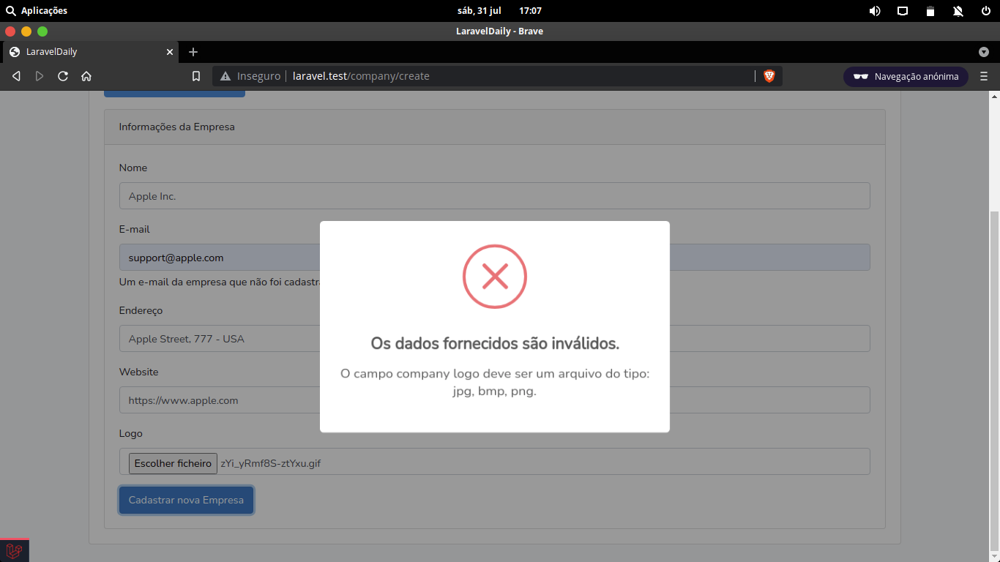
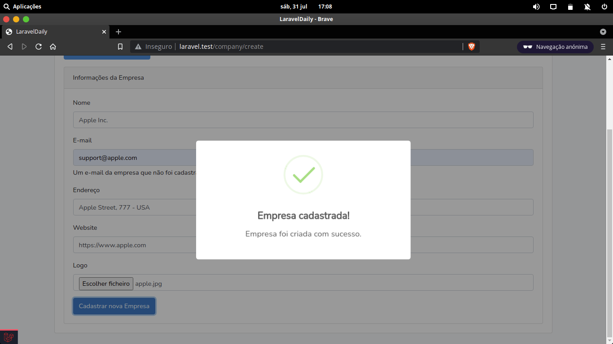
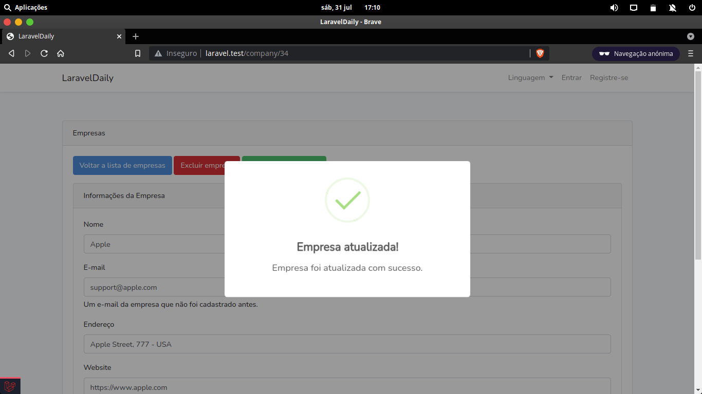
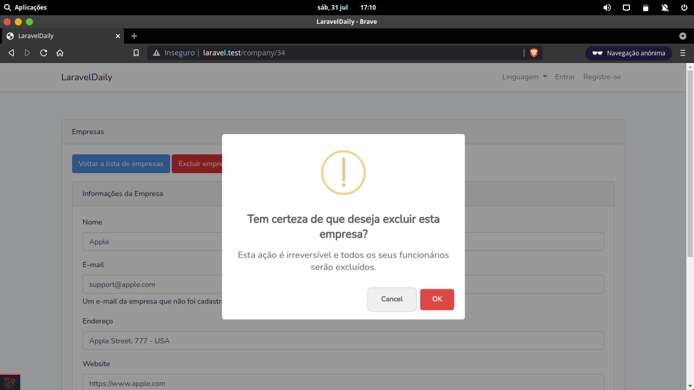
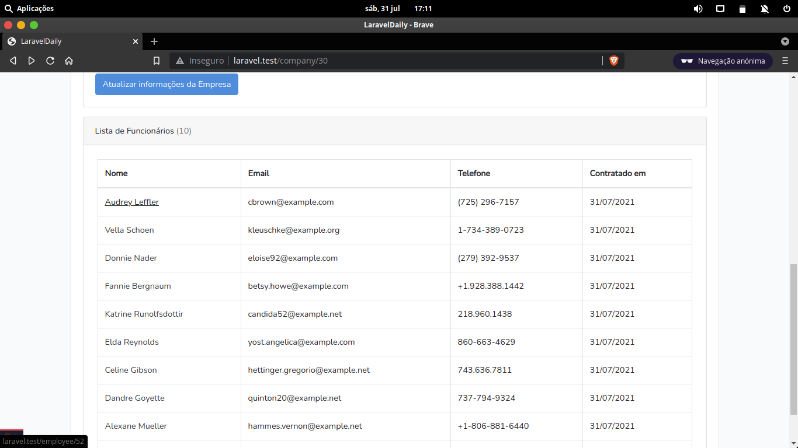
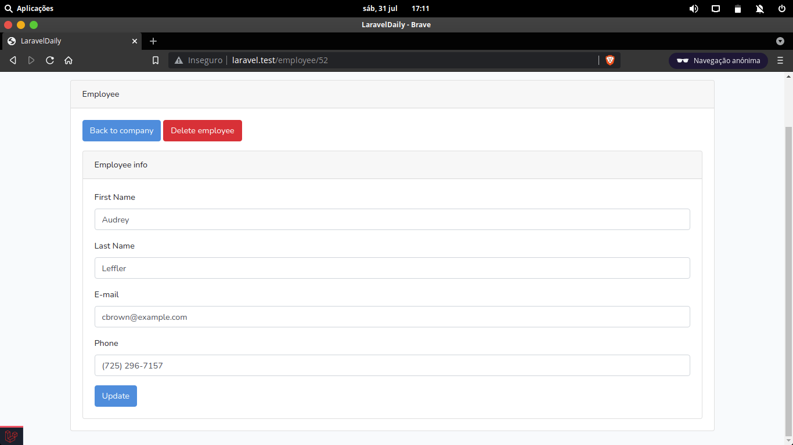

## About Project

Adminpanel to manage companies, basically, that’s it. With this simple exercise junior developer shows the skills in Laravel things.

- MVC
- Basic Laravel auth
- CRUD and Resource Controllers
- Eloquent and Relationships
- Database Migrations and Seeds
- Form Validation and Requests
- Pagination
- File management
- Email notifications
- Multi-language

## Project previews

## Learning Laravel

Laravel has the most extensive and thorough [documentation](https://laravel.com/docs) and video tutorial library of all modern web application frameworks, making it a breeze to get started with the framework.

## Developer

Daniel Monteiro - [@danielspinard](https://github.com/danielspinard)

